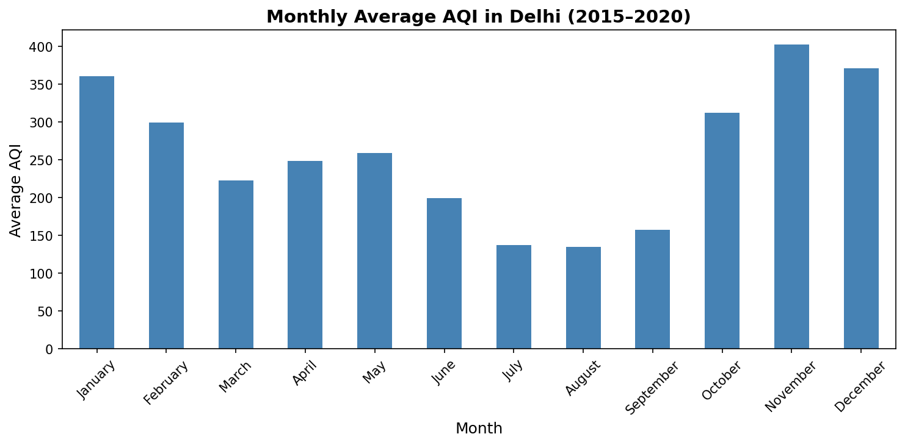
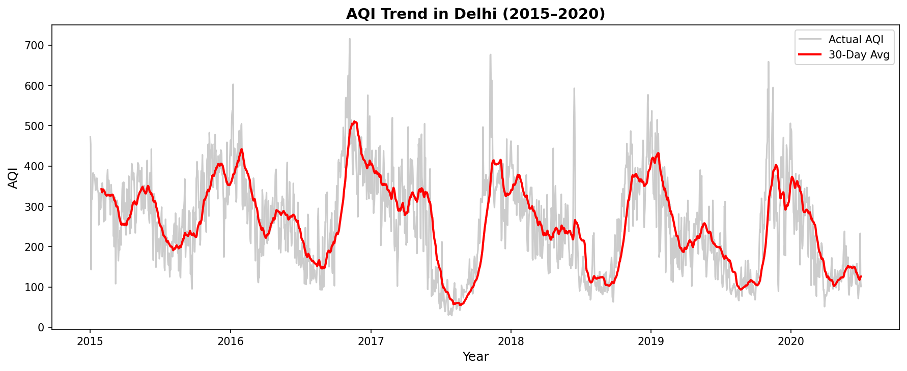
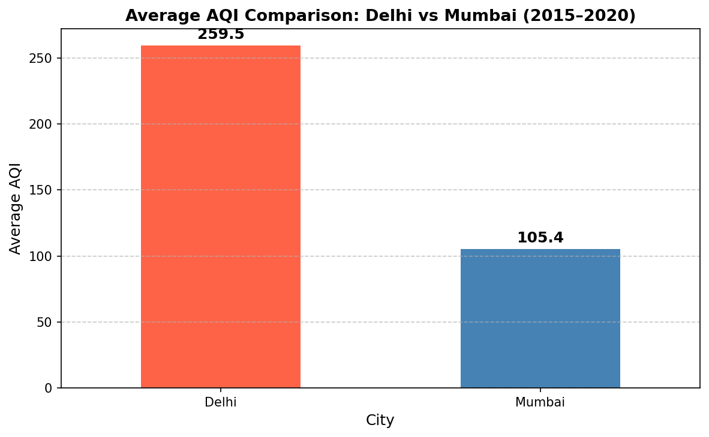
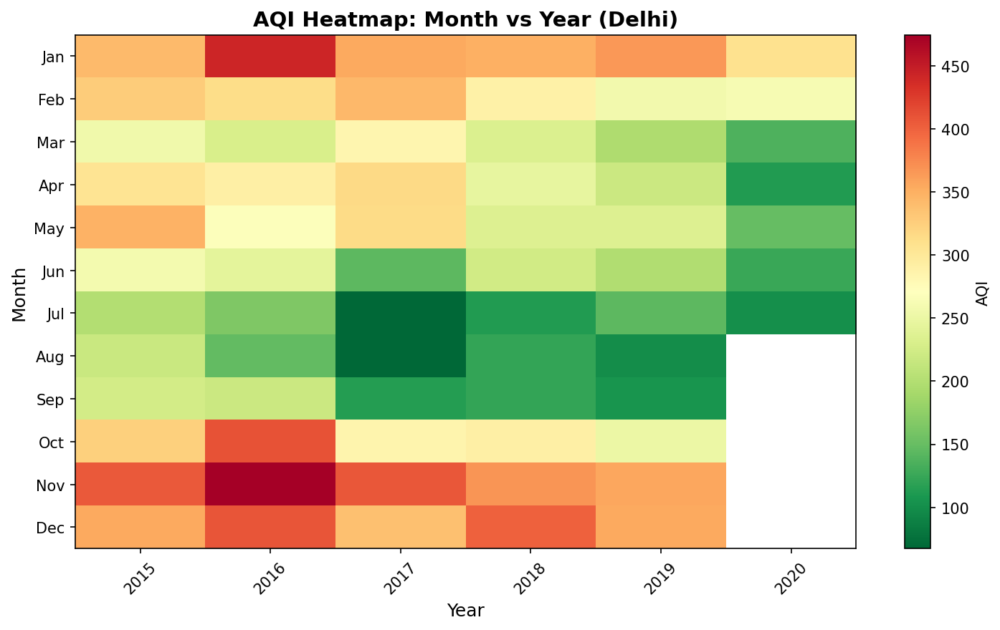
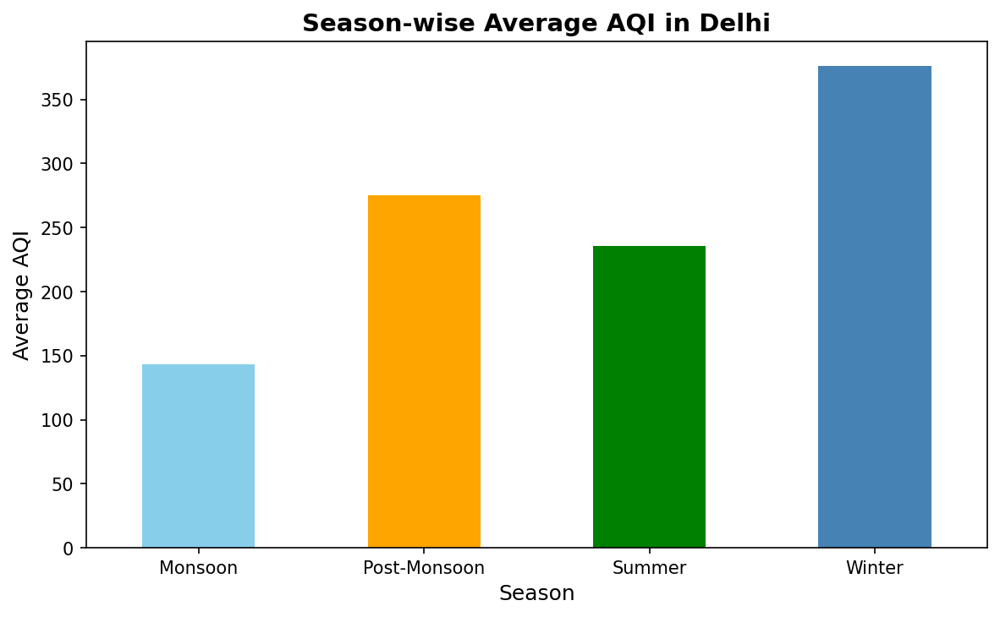
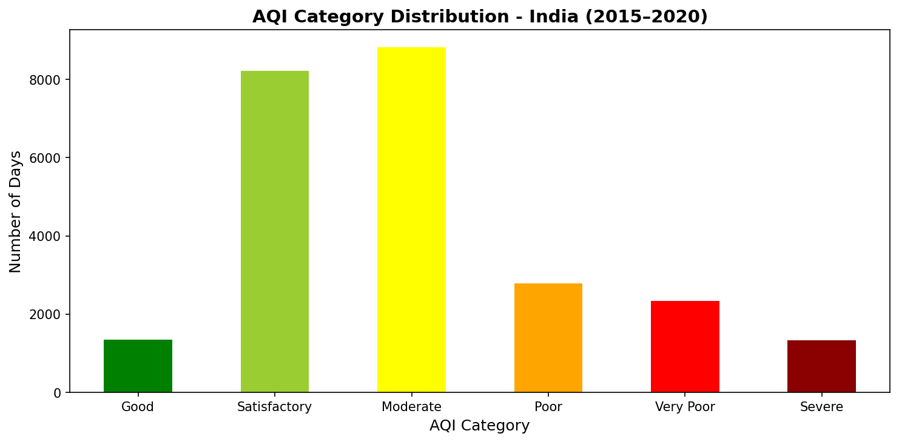

# 🌍 Air Quality Data Analysis & Pollution Trend Modelling (India)


> **Delhi Focus + Mumbai Comparison | 2015–2020**  
> A complete data analytics project using real CPCB air quality data from India.

---

## 📌 Project Overview

This project analyses real-world air quality data from Indian cities using **Python and Pandas**.  
Delhi is the primary case study, with Mumbai used for regional comparison.

The project covers:
- Data cleaning and preprocessing
- Monthly and seasonal AQI trend analysis
- City-to-city comparison
- AQI health category classification
- Rolling average trend modelling
- Linear regression to identify pollution direction
- Advanced heatmap and yearly trend visualisation

---

## 📊 Key Findings

| Finding | Value |
|---|---|
| Most Polluted Month (Delhi) | **November — AQI 402** |
| Least Polluted Month (Delhi) | **August — AQI 134** |
| Delhi Average AQI | **259.5 (Poor)** |
| Mumbai Average AQI | **105.4 (Moderate)** |
| Delhi vs Mumbai | **Delhi is 146% more polluted** |
| Pollution Trend (Slope) | **-0.057 (slowly improving)** |

---

## 📁 Project Structure

```
air-quality-analysis/
│
├── dataset/
│   └── city_day.csv                  # Raw CPCB dataset
│
├── code/
│   └── main.py                       # Complete Python analysis script
│
├── graphs/
│   ├── monthly_aqi_delhi.png         # Monthly AQI bar chart
│   ├── trend_delhi.png               # Rolling average trend
│   ├── mumbai_monthly.png            # Mumbai monthly AQI
│   ├── city_comparison.png           # Delhi vs Mumbai comparison
│   ├── aqi_distribution.png          # AQI category distribution
│   ├── linear_trend_delhi.png        # Linear regression trend line
│   ├── yearly_trend.png              # Year-wise AQI trend
│   ├── heatmap.png                   # Month × Year heatmap
│   └── season_analysis.png           # Season-wise AQI
│
├── outputs/
│   ├── Delhi_AQI_Final_Report.xlsx   # Excel report (8 sheets)
│   └── summary.txt                   # Key findings summary
│
├── documentation/
│   ├── Project_Report.pdf           # Full pdf report
│   └── project_report.md             # Markdown report
│
├── README.md
└── requirements.txt
```

---

## 📈 Visualisations

### Monthly Average AQI — Delhi


### AQI Trend with 30-Day Rolling Average — Delhi


### Delhi vs Mumbai Comparison


### AQI Heatmap (Month × Year)


### Season-wise AQI — Delhi


### AQI Category Distribution — All India


---

## 🗄️ Dataset

| Attribute | Details |
|---|---|
| Source | [Kaggle — Air Quality Data in India](https://www.kaggle.com/datasets/rohanrao/air-quality-data-in-india) |
| Original Publisher | Central Pollution Control Board (CPCB), India |
| File Used | `city_day.csv` |
| Raw Records | 29,531 |
| After Cleaning | 24,850 |
| Time Period | 2015 – 2020 |
| Cities Covered | 26 Indian cities |

---

## 🛠️ Tools & Technologies

| Tool | Purpose |
|---|---|
| Python 3.13 | Core programming language |
| Pandas | Data loading, cleaning, analysis |
| NumPy | Numerical operations |
| Matplotlib | Graphs and visualisations |
| Scikit-learn | Linear regression model |
| OpenPyXL | Excel report export |

---

## 🚀 How to Run

**1. Clone the repository**
```bash
git clone https://github.com/your-username/air-quality-analysis.git
cd air-quality-analysis
```

**2. Install required libraries**
```bash
pip install -r requirements.txt
```

**3. Run the analysis**
```bash
cd code
python main.py
```

Graphs will be saved in `graphs/` and the Excel report in `outputs/` automatically.

---

## 📋 AQI Classification (CPCB Standard)

| AQI Range | Category | Health Impact |
|---|---|---|
| 0 – 50 | Good | Minimal impact |
| 51 – 100 | Satisfactory | Minor discomfort for sensitive people |
| 101 – 200 | Moderate | Breathing discomfort for sensitive groups |
| 201 – 300 | Poor | Breathing discomfort for most people |
| 301 – 400 | Very Poor | Serious breathing difficulty |
| 401+ | Severe | Health emergency — affects healthy people |

---

## 🌿 Environmental Insights

- **Winter (Nov–Jan):** Highest AQI due to temperature inversions, stubble burning, low wind
- **Monsoon (Jul–Aug):** Lowest AQI — rain washes pollutants from air
- **Delhi vs Mumbai:** Delhi's inland location traps pollutants; Mumbai's sea breeze disperses them
- **Long-term trend:** AQI is very slowly decreasing, suggesting marginal improvement

---

## 👨‍💻 Author

** Pranav Mathur **  
M.E. Environmental Engineering  
MBM University, Jodhpur, Rajasthan

---

## 📚 References

- Central Pollution Control Board (CPCB) India — [cpcb.nic.in](https://cpcb.nic.in)
- Kaggle Dataset — [Air Quality Data in India](https://www.kaggle.com/datasets/rohanrao/air-quality-data-in-india)
- Pandas Documentation — [pandas.pydata.org](https://pandas.pydata.org)
- Scikit-learn — [scikit-learn.org](https://scikit-learn.org)

---

⭐ **If you found this project useful, give it a star!**
